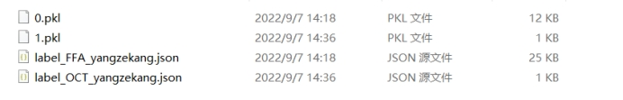
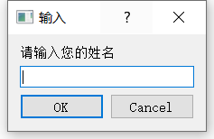
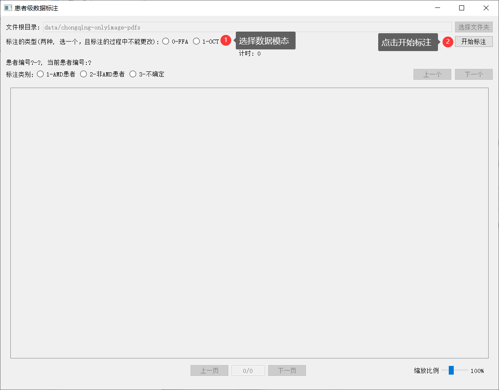
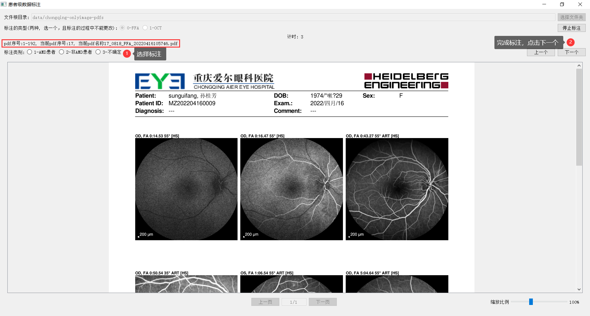
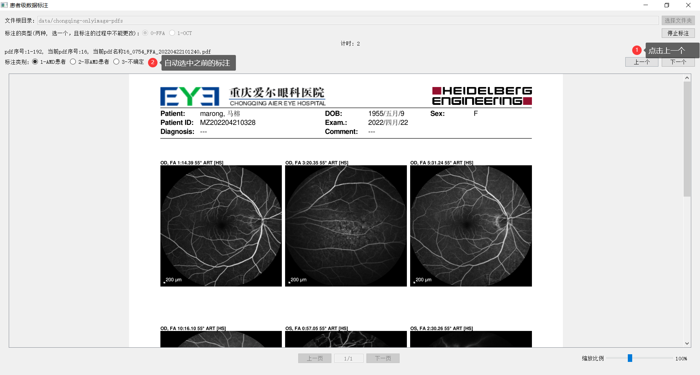
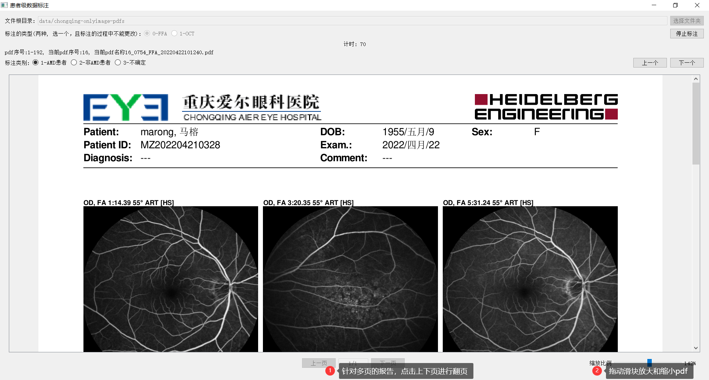
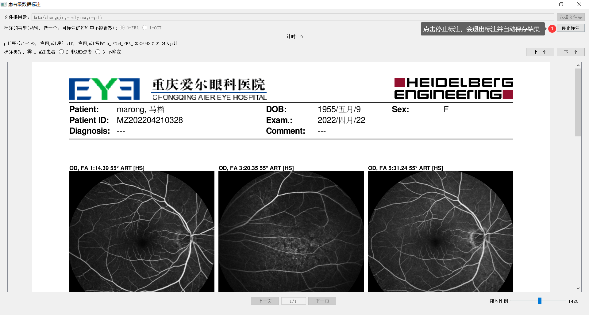
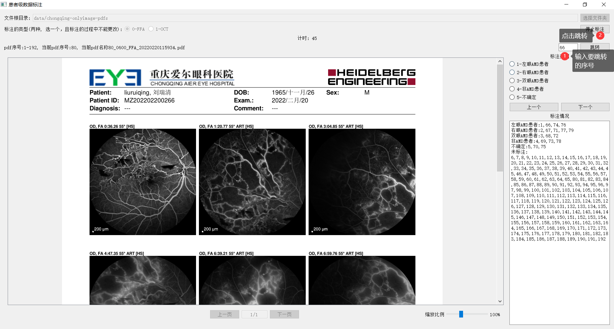
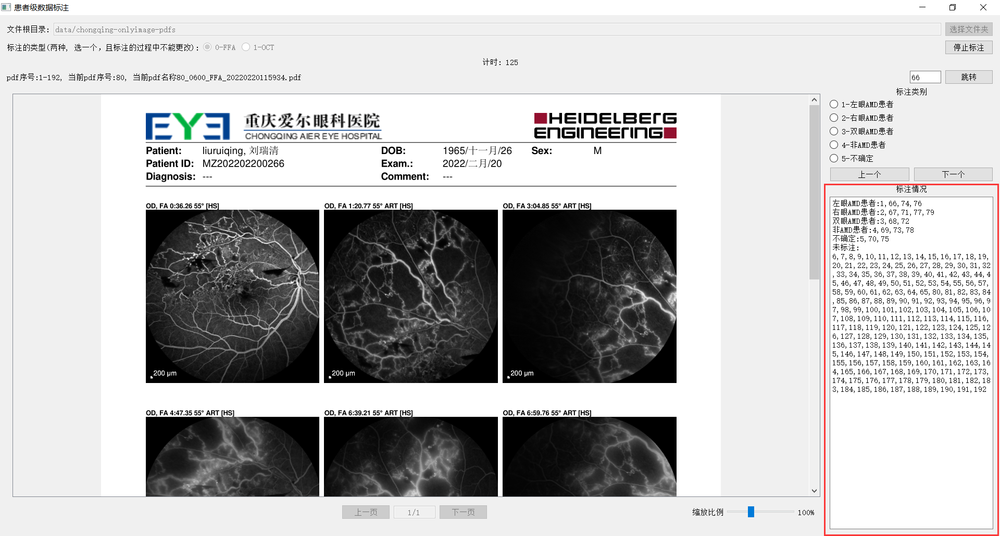

# pdf标注软件使用说明

[TOC]

## 1. **软件目录介绍**

### 1.1 data

#### 1.1.1 data/app

存放系统配置文件：

type_anno.txt 标注的类别，一行一类

type_data.txt 要标注的数据类别，一行一类

#### 1.1.2 data/chongqing-onlyimage-pdfs

存放要标注的pdf，pdf命名格式:序号_患者ID_模态_检查时间

#### 1.1.3 data/usr

用户文件夹，存储用户的中间标注记录和最终标注结果

每个模态标注结束后，标注结果分别存储在一个json文件中

 

### 1.2 pdf标注软件.exe

 双击运行，注意该文件要和data文件夹在同一文件夹内

## 2. **软件使用介绍**

### 2.1 输入姓名

在该界面输入一个唯一的用户名，确保用户名唯一，之后会根据用户名来加载标注记录

### 2.2 选择数据模态开始标注

### 2.3 顺序标注

红框内显示，需要标注的图像序列范围和当前标注的序号、文件名称

### 2.4 修改之前的标注

### 2.4 pdf阅读模块

### 2.5 停止标注

停止标注后可以退出软件，下次打开软件选中同样模态开始标注后会继续从该位置进行标注；

停止标注后也可以选择其他模态进行标注

### 2.8 页面跳转

### 2.7 显示目前标注情况

### 2.8 快捷键

| 键盘       | 按钮          |
| ---------- | ------------- |
| 1          | 1-左眼AMD患者 |
| 2          | 2-右眼AMD患者 |
| 3          | 3-双眼AMD患者 |
| 4          | 4-非AMD患者   |
| 5          | 5-不确定      |
| e          | 下一个        |
| 向下方向键 | 下一个        |
| q          | 上 一个       |
| 向上方向键 | 上一个        |

 